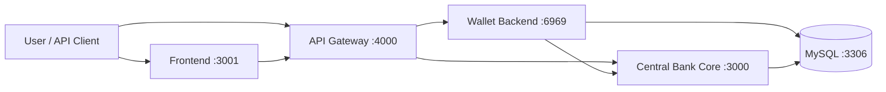

# SmartBank CBDC Integration

SmartBank adalah simulasi two-tier Central Bank Digital Currency (CBDC) untuk
pengujian integrasi antara:

- Central Bank Core: NestJS, Prisma, dan MySQL.
- Wallet Backend: Express.js.
- API Gateway: pintu masuk API pada port `4000`.
- Frontend: Next.js pada port `3001`.

Proyek ini ditujukan untuk simulasi akademis dan bukan sistem perbankan produksi.

## Arsitektur



Untuk pemakaian normal, frontend dan API client harus mengakses backend melalui
API Gateway. Port `3000` dan `6969` tetap diekspos untuk health check,
debugging, dan Swagger lokal.

## Prasyarat

- Docker Desktop dengan Docker Compose.
- PowerShell untuk menjalankan contoh API pada README ini.
- Port `3000`, `3001`, `3306`, `4000`, dan `6969` tidak sedang dipakai aplikasi lain.

Pastikan file `.env` tersedia di root proyek. Nilai minimum yang dibutuhkan:

```dotenv
MYSQL_ROOT_PASSWORD=ganti_dengan_password_root
MYSQL_DATABASE=central_bank_core
MYSQL_USER=central_bank
MYSQL_PASSWORD=ganti_dengan_password_database
JWT_SECRET=ganti_dengan_secret_acak_minimal_32_karakter
ENABLE_STAFF_SEED=true
NEXT_PUBLIC_API_BASE_URL=http://localhost:4000
```

Jangan commit file `.env` yang berisi kredensial asli.

## Menjalankan Aplikasi

Jalankan dari root proyek:

```powershell
docker compose up -d --build --wait
docker compose ps
```

Semua service seharusnya berstatus `Up` dan `healthy`.

| Layanan | URL | Kegunaan |
|---|---|---|
| Frontend | [http://localhost:3001](http://localhost:3001) | UI untuk Retail, Teller, dan Manager |
| API Gateway | [http://localhost:4000/health](http://localhost:4000/health) | Pintu masuk API |
| Wallet Swagger | [http://localhost:6969/api-docs](http://localhost:6969/api-docs) | Dokumentasi interaktif Wallet |
| Wallet Backend | [http://localhost:6969](http://localhost:6969) | Health/debug langsung |
| Central Bank Health | [http://localhost:3000/api/v1/health](http://localhost:3000/api/v1/health) | Health check Core |

Perintah Docker yang umum:

```powershell
# Melihat log semua service
docker compose logs -f

# Melihat log satu service
docker compose logs -f gateway
docker compose logs -f wallet
docker compose logs -f central-bank

# Restart tanpa menghapus data
docker compose restart

# Menghentikan stack tanpa menghapus volume database
docker compose down

# Reset total, termasuk seluruh data MySQL
docker compose down -v
docker compose up -d --build --wait
```

Perhatian: `docker compose down -v` menghapus akun, transaksi, pinjaman, dan data
lain yang tersimpan di volume MySQL.

### Menghemat Penyimpanan Docker

Periksa pemakaian disk dan RAM terlebih dahulu:

```powershell
docker system df -v
docker stats --no-stream
```

Build frontend memakai output Next.js `standalone`, sedangkan Central-Bank
memakai multi-stage build. Karena itu image runtime tidak membawa dependency
development, source TypeScript, atau cache build yang tidak diperlukan.

Pembersihan berikut tidak menghapus volume database:

```powershell
# Sisakan maksimal sekitar 1 GB build cache
docker buildx prune --force --reserved-space 1GB

# Hapus image dangling dari build lama
docker image prune --force

# Hapus cache build frontend lokal; akan dibuat lagi saat npm run build
Remove-Item -LiteralPath .\frontend\.next -Recurse -Force
```

Jangan memakai `docker system prune --volumes` atau `docker compose down -v`
jika data MySQL masih dibutuhkan. Folder `node_modules` lokal dapat dihapus
untuk menghemat ruang, tetapi harus dipasang ulang dengan `npm ci` sebelum
menjalankan test atau development di luar Docker.

## Akun Pengujian

Jika `ENABLE_STAFF_SEED=true`, Wallet membuat akun staf berikut saat startup:

| Role | Email | Password | PIN |
|---|---|---|---|
| Teller | `teller@test.com` | `password` | `123456` |
| Manager | `manager@test.com` | `password` | `123456` |
| Central Bank Admin | `admin@test.com` | `password` | `123456` |

Akun Retail dibuat melalui halaman Register. Registrasi publik selalu membuat
role `WALLET_USER` dan memberikan saldo awal `Rp 50.000`.

Route utama setelah login:

- Retail: `/dashboard`, `/transfer`, `/kyc`, `/pinjaman`, `/aktivitas`.
- Teller: `/teller/nasabah`, `/teller/operasi`.
- Manager: `/manager/risiko`, `/manager/pinjaman`.
- Central Bank Admin: `/admin`, `/admin/ledger`, `/admin/reversal`.

## Testing Manual Melalui UI

### 1. Verifikasi Stack

1. Jalankan `docker compose ps`.
2. Buka [http://localhost:4000/health](http://localhost:4000/health).
3. Pastikan respons memiliki `success: true`.
4. Buka [http://localhost:3001](http://localhost:3001).

### 2. Registrasi Dua Pengguna Retail

Gunakan dua email dan nomor telepon yang berbeda.

1. Buka `http://localhost:3001/register`.
2. Isi nama, email, nomor telepon, password minimal 8 karakter, dan PIN 6 digit.
3. Daftarkan User A, lalu catat email dan PIN-nya.
4. Logout dan ulangi untuk User B.
5. Setelah registrasi, user otomatis login dan saldo awal harus tampil
   `Rp 50.000`.
6. Buka menu `Verifikasi KYC` atau route `/kyc`.
7. Isi jenis dokumen, nomor identitas, nama sesuai dokumen, lalu upload PNG,
   JPG, WEBP, atau PDF maksimal 500KB.
8. Status tetap `BASIC` sampai Teller memeriksa dan menyetujui dokumen.

### 3. Testing Teller

1. Login sebagai `teller@test.com` dengan password `password`.
2. Cari User A menggunakan email, nomor telepon, atau User ID.
3. Periksa jenis, nomor, nama, dan preview dokumen identitas nasabah.
4. Jika dokumen belum ada, tombol verifikasi tidak boleh digunakan.
5. Isi reason code, misalnya `MANUAL_TEST_KYC`.
6. Klik verifikasi KYC dan pastikan status berubah menjadi `VERIFIED`.
7. Lakukan top-up, misalnya `100000`, lalu periksa pesan sukses.
8. Lakukan withdraw dengan nominal lebih kecil, misalnya `10000`.
9. Cari User B dan catat `Wallet ID` yang ditampilkan. Wallet ID ini dipakai
   sebagai tujuan transfer.

### 4. Testing Transfer Retail

1. Logout dari Teller, lalu login sebagai User A.
2. Pada bagian Transfer, masukkan Wallet ID User B.
3. Masukkan nominal, catatan, dan PIN User A.
4. Klik `Kirim dana`.
5. Pastikan muncul pesan sukses dan transaksi baru tampil di Aktivitas.
6. Login sebagai User B dan pastikan saldo serta riwayat transaksi bertambah.

Catatan:

- Transfer ke Wallet ID sendiri akan ditolak.
- Nominal harus berupa bilangan bulat positif.
- Sistem menerapkan cooldown transaksi dan batas transaksi harian.
- Biaya transaksi dapat membuat total debit lebih besar dari nominal transfer.

### 5. Testing Pinjaman dan Manager

1. Login sebagai User A.
2. Ajukan pinjaman, misalnya `10000`.
3. Jika KYC masih `BASIC`, pengajuan harus ditolak.
4. Setelah KYC `VERIFIED`, pengajuan akan berstatus `PENDING` dan belum
   menambah saldo.
5. Logout dan login sebagai `manager@test.com`.
6. Buka `/manager/pinjaman`. Loan muncul otomatis bersama nama, email, KYC,
   saldo, pokok, bunga, total tagihan, dan dokumen borrower.
7. Isi reason code, misalnya `MANUAL_TEST_APPROVAL`.
8. Klik `Setujui pinjaman` atau `Tolak pinjaman` pada card loan.
9. Jika disetujui, login kembali sebagai User A dan pastikan saldo bertambah.
10. Untuk pembayaran, masukkan Loan ID, nominal pembayaran, dan PIN di halaman
    Retail.

### 6. Testing Suspend dan Activate

1. Login sebagai Manager.
2. Cari User B menggunakan email, telepon, atau User ID.
3. Isi reason code dan klik `Bekukan akun`.
4. Pastikan User B tidak dapat login.
5. Kembali ke dashboard Manager dan aktifkan kembali akun tersebut.
6. Pastikan User B dapat login lagi.

### Hasil Minimum yang Diharapkan

- Semua halaman utama dapat dibuka tanpa error `502`.
- Registrasi menghasilkan akun Retail dan saldo awal.
- Nasabah dapat upload dokumen ID dan Teller melihat dokumen sebelum verifikasi.
- Nasabah `BASIC` tidak dapat mengajukan pinjaman dan saldo maksimalnya
  `Rp 100.000`.
- Teller dapat mencari user, verifikasi KYC, top-up, dan withdraw.
- Transfer mengurangi saldo pengirim dan menambah saldo penerima.
- Pinjaman tetap `PENDING` sebelum keputusan Manager.
- Manager melihat antrean pinjaman beserta data borrower tanpa input Loan ID.
- Approve pinjaman mencairkan dana, sedangkan reject tidak mencairkan dana.
- Suspend memblokir login dan activate memulihkan akses.
- Admin dapat login dan membuka dashboard operasi bank sentral.

## Testing API dengan PowerShell

Semua contoh berikut menggunakan API Gateway:

```powershell
$baseUrl = "http://localhost:4000"
```

### Registrasi dan Login

Gunakan email baru setiap kali mengulang registrasi.

```powershell
$email = "manual.$(Get-Date -Format 'yyyyMMddHHmmss')@test.local"
$password = "password123"
$pin = "123456"

$registerBody = @{
  name = "Manual API User"
  email = $email
  phone = "08$(Get-Random -Minimum 1000000000 -Maximum 1999999999)"
  password = $password
  pin = $pin
} | ConvertTo-Json

Invoke-RestMethod `
  -Method Post `
  -Uri "$baseUrl/api/wallet/v1/auth/register" `
  -ContentType "application/json" `
  -Body $registerBody

$loginBody = @{
  email = $email
  password = $password
} | ConvertTo-Json

$login = Invoke-RestMethod `
  -Method Post `
  -Uri "$baseUrl/api/wallet/v1/auth/login" `
  -ContentType "application/json" `
  -Body $loginBody

$token = $login.data.accessToken
$walletId = $login.data.user.walletId
$authHeaders = @{
  Authorization = "Bearer $token"
  "X-Request-Id" = "manual-$([guid]::NewGuid())"
}
```

### Cek Saldo dan Riwayat

```powershell
Invoke-RestMethod `
  -Method Get `
  -Uri "$baseUrl/api/wallet/v1/wallets/me/balance" `
  -Headers $authHeaders

Invoke-RestMethod `
  -Method Get `
  -Uri "$baseUrl/api/wallet/v1/wallets/me/transactions" `
  -Headers $authHeaders
```

### Transfer

Ganti `wal_tujuan` dengan Wallet ID pengguna lain.

```powershell
$transferHeaders = @{
  Authorization = "Bearer $token"
  "Idempotency-Key" = "$([guid]::NewGuid())"
  "X-Wallet-Pin" = $pin
}

$transferBody = @{
  to_wallet_id = "wal_tujuan"
  amount = "1000"
  note = "Manual API test"
} | ConvertTo-Json

Invoke-RestMethod `
  -Method Post `
  -Uri "$baseUrl/api/wallet/v1/transfers" `
  -Headers $transferHeaders `
  -ContentType "application/json" `
  -Body $transferBody
```

### Ajukan Pinjaman

```powershell
$loanHeaders = @{
  Authorization = "Bearer $token"
  "Idempotency-Key" = "$([guid]::NewGuid())"
}

$loan = Invoke-RestMethod `
  -Method Post `
  -Uri "$baseUrl/api/wallet/v1/loans/apply" `
  -Headers $loanHeaders `
  -ContentType "application/json" `
  -Body (@{ amount = "10000" } | ConvertTo-Json)

$loan.data.loan
```

### Login Manager dan Setujui Pinjaman

```powershell
$managerLogin = Invoke-RestMethod `
  -Method Post `
  -Uri "$baseUrl/api/wallet/v1/auth/login" `
  -ContentType "application/json" `
  -Body (@{
    email = "manager@test.com"
    password = "password"
  } | ConvertTo-Json)

$managerHeaders = @{
  Authorization = "Bearer $($managerLogin.data.accessToken)"
  "Idempotency-Key" = "$([guid]::NewGuid())"
}

Invoke-RestMethod `
  -Method Post `
  -Uri "$baseUrl/api/bank/manager/loans/approve" `
  -Headers $managerHeaders `
  -ContentType "application/json" `
  -Body (@{
    loanId = "ganti_dengan_loan_id"
    reasonCode = "MANUAL_API_APPROVAL"
  } | ConvertTo-Json)
```

## Konvensi API

### Base URL

| API | Base URL melalui Gateway |
|---|---|
| Wallet | `http://localhost:4000/api/wallet/v1` |
| Central Bank | `http://localhost:4000/api/bank` |

Gateway menghapus prefix tersebut sebelum meneruskan request ke service tujuan.

### Header

| Header | Kapan digunakan |
|---|---|
| `Authorization: Bearer <token>` | Semua endpoint protected |
| `Content-Type: application/json` | Request dengan JSON body |
| `Idempotency-Key: <nilai-unik>` | Operasi finansial dan mutasi penting |
| `X-Wallet-Pin: <6 digit>` | Transfer, pembayaran invoice, top-up, withdraw, stimulus |
| `X-Request-Id: <nilai-unik>` | Opsional untuk pelacakan log |

PIN juga diterima melalui body dengan field `pin` atau `wallet_pin`, tetapi
`X-Wallet-Pin` lebih disarankan untuk pengujian API.

Gunakan Idempotency Key baru untuk transaksi baru. Mengulang request yang sama
dengan key yang sama harus menghasilkan hasil yang konsisten. Jangan memakai
key lama untuk payload yang berbeda.

### Format Respons

Respons Wallet dan Gateway menggunakan envelope berikut:

```json
{
  "success": true,
  "data": {},
  "error": null,
  "meta": {
    "request_id": "req_example",
    "timestamp": "2026-06-11T00:00:00.000Z"
  }
}
```

Contoh error:

```json
{
  "success": false,
  "data": null,
  "error": {
    "code": "BAD_REQUEST",
    "message": "Data tidak valid",
    "details": {}
  },
  "meta": {
    "request_id": "req_example",
    "timestamp": "2026-06-11T00:00:00.000Z"
  }
}
```

Gateway membatasi sekitar 100 request per menit per client.

## Endpoint Wallet

Semua path di tabel menggunakan base URL
`http://localhost:4000/api/wallet/v1`.

| Method | Path | Akses | Body/parameter utama |
|---|---|---|---|
| `POST` | `/auth/register` | Public | `name`, `email`, `phone`, `password`, `pin` |
| `POST` | `/auth/login` | Public | `email`, `password` |
| `GET` | `/wallets/me/balance` | JWT | Tidak ada |
| `GET` | `/wallets/me/transactions` | JWT | Tidak ada |
| `GET` | `/wallets/me/kyc-document` | JWT | Status dan dokumen KYC user |
| `PUT` | `/wallets/me/kyc-document` | JWT | `documentType`, `documentNumber`, `documentName`, `documentDataUrl` |
| `POST` | `/wallets/me/topup` | JWT + PIN | `amount` |
| `POST` | `/wallets/me/withdraw` | JWT + PIN | `amount` |
| `POST` | `/wallets/me/claim-stimulus` | JWT + PIN | Tidak ada |
| `PUT` | `/wallets/me/profile` | JWT | `name`, opsional `phone` |
| `PUT` | `/wallets/me/security` | JWT | `password` dan/atau `pin` |
| `PUT` | `/wallets/me/upgrade` | JWT | `role`, `businessName`, `nik` |
| `POST` | `/wallets/me/subscribe-insight` | JWT | Tidak ada |
| `POST` | `/wallets/me/invoice/generate-test` | JWT, development | Membuat invoice uji |
| `POST` | `/transfers` | Wallet User + PIN + Idempotency | `to_wallet_id`, `amount`, opsional `note` |
| `POST` | `/payment-requests/:id/pay` | Wallet User + PIN + Idempotency | Path parameter `id` |
| `POST` | `/loans/apply` | Wallet User + Idempotency | `amount` |
| `POST` | `/loans/:loan_id/repay` | Wallet User + Idempotency | `amount` |

Aturan payload penting:

- Password registrasi harus 8 sampai 128 karakter.
- PIN harus tepat 6 digit.
- Nominal transaksi harus berupa bilangan bulat positif.
- Role upgrade yang diterima: `MERCHANT`, `CASHIER`, `SUPPLIER`, `LOGISTICS`,
  atau `ANALYTICS_VIEWER`.
- NIK untuk upgrade harus berupa 16 digit.

## Endpoint Central Bank

Semua path di tabel menggunakan base URL
`http://localhost:4000/api/bank`.

| Method | Path | Role | Body/query utama |
|---|---|---|---|
| `POST` | `/auth/register` | Public | `name`, `email`, `password` |
| `POST` | `/auth/login` | Public | `email`, `password` |
| `GET` | `/health` | JWT via Gateway | Tidak ada |
| `POST` | `/fees/quote` | JWT via Gateway | `source_app`, `amount` |
| `GET` | `/wallets/me/balance` | Wallet User | Tidak ada |
| `GET` | `/wallets/me/transactions` | Wallet User | Tidak ada |
| `POST` | `/transfers` | Wallet User + Idempotency | `to_wallet_id`, `amount`, opsional `note` |
| `POST` | `/payment-requests` | Wallet User + Idempotency | Detail payer, payee, nominal, deskripsi, expiry |
| `POST` | `/payment-requests/:id/pay` | Wallet User + Idempotency | Path parameter `id` |
| `POST` | `/loans/apply` | Wallet User + Idempotency | `amount`, opsional `purpose` |
| `POST` | `/loans/:id/repay` | Wallet User + Idempotency | `amount` |
| `GET` | `/teller/customer?query=...` | Teller atau Manager | Email, telepon, atau User ID |
| `POST` | `/teller/kyc/verify` | Teller atau Manager | `userId`, opsional `reasonCode` |
| `POST` | `/teller/top-up` | Teller/Manager + Idempotency | `userId`, `amount`, opsional `reasonCode` |
| `POST` | `/teller/withdraw` | Teller/Manager + Idempotency | `userId`, `amount`, opsional `reasonCode` |
| `POST` | `/manager/users/suspend` | Manager | `userId`, opsional `reasonCode` |
| `POST` | `/manager/users/activate` | Manager | `userId`, opsional `reasonCode` |
| `GET` | `/manager/loans/pending` | Manager | Daftar loan pending beserta borrower |
| `POST` | `/manager/loans/approve` | Manager + Idempotency | `loanId`, opsional `reasonCode` |
| `POST` | `/manager/loans/reject` | Manager + Idempotency | `loanId`, opsional `reasonCode` |
| `GET` | `/central-bank/supply` | Central Bank Admin | Tidak ada |
| `GET` | `/central-bank/ledger` | Central Bank Admin | `account_id`, `transaction_id`, `from`, `to` |
| `POST` | `/central-bank/reversals` | Central Bank Admin + Idempotency | `original_transaction_id`, `reason_code`, opsional `note` |

Nilai `source_app` yang valid:

- Fee quote: `TRANSFER`, `MARKETPLACE`, `POS`, `SUPPLIER`, `LOGISTICS`.
- Payment request: `MARKETPLACE`, `POS`, `SUPPLIER`, `LOGISTICS`.

Contoh body pembuatan payment request:

```json
{
  "source_app": "MARKETPLACE",
  "payer_wallet_id": "wal_payer",
  "payee_wallet_id": "wal_merchant",
  "gross_amount": "25000",
  "description": "Pembelian barang uji",
  "metadata": {
    "order_id": "ORDER-001"
  },
  "expires_at": "2026-06-12T12:00:00.000Z"
}
```

## Aturan Finansial Utama

- Saldo awal pengguna: `Rp 50.000`.
- Limit saldo nasabah `BASIC`: `Rp 100.000`.
- Pengajuan pinjaman hanya tersedia untuk nasabah KYC `VERIFIED`.
- Total money supply default: `Rp 1.000.000.000`.
- Maksimum pinjaman default: `Rp 100.000`.
- Bunga pinjaman flat: 10 persen.
- Batas transaksi default: 10 transaksi per hari.
- Cooldown transaksi default: 10 detik.
- Transfer dan pembayaran dapat dikenai biaya bank, gateway, dan pajak.

Nilai aktual dapat diubah melalui environment variable pada `docker-compose.yml`.

## Troubleshooting

### Container tidak healthy

```powershell
docker compose ps
docker compose logs --tail 200 mysql
docker compose logs --tail 200 central-bank
docker compose logs --tail 200 wallet
docker compose logs --tail 200 gateway
docker compose logs --tail 200 frontend
```

### Frontend menampilkan 502

1. Pastikan Gateway, Wallet, dan Central Bank berstatus healthy.
2. Periksa `NEXT_PUBLIC_API_BASE_URL=http://localhost:4000`.
3. Build ulang frontend setelah mengubah environment variable:

```powershell
docker compose up -d --build --wait frontend
```

### Login staf gagal

1. Pastikan `.env` berisi `ENABLE_STAFF_SEED=true`.
2. Restart Wallet:

```powershell
docker compose restart wallet
docker compose logs --tail 100 wallet
```

### Error cooldown atau daily limit

Tunggu minimal 10 detik sebelum mengulang transaksi. Jika batas harian tercapai,
gunakan akun uji lain atau reset volume database khusus untuk lingkungan uji.

### Port sudah digunakan

Cari proses/container yang memakai port:

```powershell
docker ps
Get-NetTCPConnection -State Listen |
  Where-Object LocalPort -In 3000,3001,3306,4000,6969
```

## Struktur Direktori

```text
integration/
|-- Central-Bank/       # NestJS Central Bank Core
|-- Wallet/             # Express Wallet Backend dan Swagger
|-- Gateway/            # Express API Gateway
|-- frontend/           # Next.js role-based frontend
|-- docker-compose.yml  # Orkestrasi seluruh service
|-- .env                # Konfigurasi lokal, tidak boleh di-commit
|-- memory.md           # Catatan perubahan lintas sesi
`-- README.md
```

## Referensi Docker

- [docker compose up](https://docs.docker.com/reference/cli/docker/compose/up/)
- [docker compose logs](https://docs.docker.com/reference/cli/docker/compose/logs/)
- [docker compose down](https://docs.docker.com/reference/cli/docker/compose/down/)
