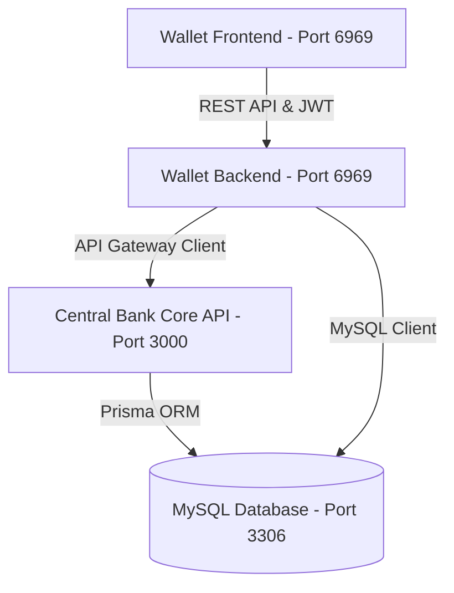

# 🏦 SmartBank Ecosystem - Two-Tier CBDC Simulation

SmartBank adalah sistem simulasi **Two-Tier CBDC (Central Bank Digital Currency)** terintegrasi untuk akademis tingkat lanjut (RPL 2). Proyek ini menyatukan dua modul utama:

1. **Central Bank Core (Tier-1):** Settlement engine moneter berbasis NestJS, Prisma, dan MySQL untuk pemrosesan saldo, pembukuan double-entry ledger, pinjaman kredit, dan manajemen persediaan uang.
2. **SmartBank Wallet (Tier-2):** Aplikasi retail e-wallet berbasis Express.js dan Vanilla UI premium dengan peran dinamis (Merchant, Cashier, Supplier, dll.) dan visual auditing ledger.

---

## 🏗️ Diagram Arsitektur & Alur Data

Sistem beroperasi berdasarkan aturan moneter bank sentral, di mana mutasi saldo riil hanya dapat dipicu melalui permohonan aman (*payment request* / *transfer*) ke Central Bank Core:



---

## 🌟 Fitur & Aturan Keuangan SmartBank

Sistem moneter ini mensimulasikan operasional bank ritel yang terikat pada aturan ketat Bank Sentral:

### 1. Fitur Utama Sistem
*   **Transfer P2P Instan:** Pengiriman dana antar-rekening dompet secara real-time. Dilengkapi dengan verifikasi PIN transaksi dan perlindungan idempotensi.
*   **Sistem Kredit Pinjaman UMKM:** Pengajuan pinjaman modal usaha secara digital dari Pool Dana Kredit Bank Sentral. Pengguna dapat melunasi tagihan secara bertahap (cicilan) maupun penuh.
*   **Settle Pembayaran QR / Invoice:** Pembayaran tagihan belanja merchant secara aman melalui alur ACID Transaction untuk menjamin uang terkirim secara utuh.
*   **Top-Up & Withdrawal Simulasi:** Penambahan saldo digital instan langsung dari Reserve Bank Sentral dan simulasi pencairan uang digital menjadi uang tunai (withdraw).
*   **Economic Stimulus Claim:** Fitur klaim bantuan stimulus digital dari negara langsung ke akun pengguna.

### 2. Aturan & Kebijakan Keuangan (Financial Rules)
*   **Suplai Uang Maksimal (Total Money Supply / M0):** Rp 1.000.000.000 (1 Miliar CBDC_IDR). Nilai ini dipertahankan sebagai batas atas pasokan moneter sistem.
*   **Saldo Awal Akun (Initial Balance):** Setiap pengguna baru yang mendaftar secara otomatis mendapatkan alokasi awal senilai **Rp 50.000**.
*   **Kebijakan Biaya Transaksi (Transaction Fee Rules):**
    Setiap transaksi P2P atau pembayaran tagihan dikenakan biaya gabungan secara otomatis oleh Bank Sentral (ditanggung oleh pengirim/payer):
    *   **Bank Fee:** **1.00%** (100 bps) -> Masuk ke akun sistem `FEE_BANK`.
    *   **Gateway Fee:** **0.50%** (50 bps) -> Masuk ke akun sistem `FEE_GATEWAY`.
    *   **Pajak Sistem (Tax Sink):** **2.00%** (200 bps) -> Masuk ke akun kas negara `TAX_SINK`.
    *   *Total Potongan Biaya:* **3.50%** dari nilai kotor transaksi.
*   **Biaya Sektor Aplikasi Khusus (App Specific Fees):**
    *   **Marketplace:** **2.00%** (200 bps) -> Masuk ke akun `FEE_MARKETPLACE`.
    *   **Point of Sale (POS):** **1.00%** (100 bps) -> Masuk ke akun `FEE_POS`.
    *   **Supplier:** **3.00%** (300 bps) -> Masuk ke akun `FEE_SUPPLIER`.
    *   **Logistics:** Flat **Rp 5.000** -> Masuk ke akun `FEE_LOGISTICS`.
*   **Aturan Pinjaman Kredit (UMKM Loan Rules):**
    *   **Limit Maksimal Pinjaman:** **Rp 100.000** per pengguna (outstanding pinjaman aktif tidak boleh melebihi nilai ini).
    *   **Suku Bunga Flat:** **10%** dari total pokok pinjaman yang langsung ditambahkan pada saat pengajuan disetujui.
*   **Batas Transaksi & Keamanan (Spam Protection):**
    *   **Limit Transaksi Harian:** Maksimal **10 transaksi** per hari.
    *   **Cooldown Transaksi:** Jeda wajib **10 detik** antar-transaksi untuk mencegah *double-spending* atau spamming.

---

## 📖 Struktur API & Endpoint Dokumentasi

Sistem menyediakan dua portal API yang terpisah untuk menjaga keamanan dan isolasi tingkat arsitektur (Tier-1 & Tier-2):

### 1. SmartBank Wallet API (Tier-2 - Port 6969)
Disediakan khusus untuk aplikasi retail e-wallet, frontend pengguna, dan aplikasi eksternal mitra yang ingin berintegrasi.

*   **Dokumentasi Swagger UI:** Buka **[http://localhost:6969/api-docs](http://localhost:6969/api-docs)** di browser Anda.

#### Daftar Endpoint Wallet:
*   **Autentikasi (Public):**
    *   `POST /api/v1/auth/register` - Pendaftaran pengguna e-wallet baru.
    *   `POST /api/v1/auth/login` - Masuk log untuk mendapatkan token JWT akses (`accessToken`).
*   **Manajemen Akun & Saldo (Protected JWT):**
    *   `GET /api/v1/wallets/me/balance` - Cek saldo digital terkini yang tercatat di Bank Sentral.
    *   `GET /api/v1/wallets/me/transactions` - Riwayat mutasi rekening dan transaksi.
    *   `POST /api/v1/wallets/me/topup` - Simulasi penambahan saldo digital dari Bank Sentral.
    *   `POST /api/v1/wallets/me/withdraw` - Penarikan saldo digital menjadi uang tunai.
    *   `POST /api/v1/wallets/me/claim-stimulus` - Mengklaim dana stimulus moneter.
    *   `PUT /api/v1/wallets/me/profile` - Memperbarui informasi profil pengguna.
    *   `PUT /api/v1/wallets/me/security` - Mengubah PIN transaksi (6-digit) atau password.
    *   `PUT /api/v1/wallets/me/upgrade` - Mengajukan upgrade status keanggotaan limit akun.
    *   `POST /api/v1/wallets/me/subscribe-insight` - Berlangganan ringkasan info keuangan mingguan.
*   **Transaksi Finansial (Protected JWT + PIN + Idempotency-Key):**
    *   `POST /api/v1/transfers` - Mengirim dana P2P ke wallet pengguna lain.
    *   `POST /api/v1/payment-requests/:id/pay` - Melakukan pembayaran tagihan QR / invoice.
*   **Fasilitas Kredit UMKM (Protected JWT + Idempotency-Key):**
    *   `POST /api/v1/loans/apply` - Mengajukan pinjaman kredit modal baru.
    *   `POST /api/v1/loans/:loan_id/repay` - Membayar angsuran / cicilan kredit aktif.
*   **Developer Helpers:**
    *   `POST /api/v1/wallets/me/invoice/generate-test` - Membuat tagihan simulasi belanja untuk pengujian bayar.

---

### 2. Central Bank Core API (Tier-1 - Port 3000)
Merupakan backend internal bank sentral yang mengontrol perputaran moneter dasar dan pembukuan ledger ACID. Aplikasi retail eksternal tidak disarankan memanggil core ini secara langsung demi alasan keamanan.

#### Daftar Endpoint Core:
*   **Kesehatan Sistem:**
    *   `GET /api/v1/health` - Status kesehatan server bank sentral.
*   **Internal Ledger & Audit Moneter:**
    *   `GET /api/v1/central-bank/supply` - Memantau integritas total suplai uang beredar di sistem.
    *   `GET /api/v1/central-bank/ledger` - Menampilkan data entri jurnal pembukuan ganda secara menyeluruh.
    *   `POST /api/v1/central-bank/reversals` - Pembatalan/reversal transaksi secara ACID jika terjadi kegagalan.
*   **Core Settlements (Untuk Wallet Backend):**
    *   `POST /api/v1/auth/register` & `POST /api/v1/auth/login` - Penyiapan akun moneter terpusat.
    *   `GET /api/v1/wallets/me/balance` & `GET /api/v1/wallets/me/transactions` - Settlement saldo buku besar.
    *   `POST /api/v1/transfers` - Settlement transfer P2P di ledger sentral.
    *   `POST /api/v1/payment-requests` & `POST /api/v1/payment-requests/:id/pay` - Membuat dan menyelesaikan tagihan merchant.
    *   `POST /api/v1/loans/apply` & `POST /api/v1/loans/:id/repay` - Settlement pinjaman dan cicilan di ledger pool.
    *   `POST /api/v1/fees/quote` - Estimasi kalkulasi potongan biaya (BPS) transaksi.

---

## 💾 3. Unifikasi Database Terpadu (MySQL)

Kedua modul terintegrasi dalam **satu database MySQL lokal** yang sama (`central_bank_core`).
*   **Central Bank Core** mengelola tabel-tabel ledger pembukuan ganda (`ledger_entries`), transaksi settled (`transactions`), permohonan (`payment_requests`), pinjaman (`loans`), dan kebijakan moneter (`monetary_policy_events`).
*   **SmartBank Wallet** mengelola kredensial keamanan pengguna (`users`) dan cache performa lokal (`wallet_accounts_cache`).
*   **Skema Terpadu:** Wallet menggunakan tabel `users` milik Central Bank yang diperluas secara otomatis dengan kolom tambahan (`phone` dan `pin_hash`) tanpa mengganggu struktur internal core bank sentral.

---

## ⚙️ 4. Prasyarat Sistem (Prerequisites)

*   **Docker** dan **Docker Compose** (Rekomendasi Utama)
*   *Atau* **Node.js** (>= 18.x) & **MySQL Server** (8.x) jika dijalankan secara manual tanpa container.

---

## 🚀 5. Panduan Menjalankan Proyek dengan Docker (Rekomendasi Utama)

Dengan Docker Compose, Anda dapat membangun dan menjalankan seluruh ekosistem SmartBank (Database, Central Bank Core, Web UI, dan Wallet Backend) dengan satu perintah instan:

### Langkah 1: Jalankan Docker Compose
Buka terminal di folder root `SmartBank` dan jalankan perintah berikut:
```bash
docker compose up --build
```

Perintah ini akan secara otomatis:
1. Menyalakan database **MySQL** dan melakukan *health check* kesiapan database.
2. Membangun container **Central Bank Core API** (NestJS), menjalankan migrasi Prisma (`migrate deploy`), menjalankan data seed moneter awal (`seed.ts`), dan mendengarkan port `3000`.
3. Membangun container **Central Bank UI Client** (React Vite) dan mendengarkan port `5173`.
4. Membangun container **SmartBank Wallet** (ExpressJS), menjalankan sinkronisasi tabel & alter kolom tambahan pada MySQL (`migrate.js`), dan mendengarkan port `6969`.

### Langkah 2: Buka Browser Anda
Setelah seluruh container berstatus `running` dan sehat, Anda siap mengakses ekosistem moneter:
*   **Aplikasi Dompet Retail Utama (SmartBank Wallet):** Buka **[http://localhost:6969](http://localhost:6969)**
*   **Dokumentasi API Swagger (Interactive API Wallet):** Buka **[http://localhost:6969/api-docs](http://localhost:6969/api-docs)**
*   **Central Bank Test Client (UI Developer):** Buka **[http://localhost:5173](http://localhost:5173)**
*   **Health Check API Central Bank:** Akses **[http://localhost:3000/api/v1/health](http://localhost:3000/api/v1/health)**

---

## 🛠️ 6. Panduan Menjalankan Proyek secara Manual (Alternatif Non-Docker)

Jika Anda ingin menjalankan secara lokal tanpa Docker, ikuti langkah-langkah di bawah:

### Langkah 1: Persiapan Database MySQL Lokal
Pastikan server MySQL lokal Anda aktif di port **`3306`** (misalnya via Laragon/XAMPP).
*   **Database Name:** `central_bank_core`
*   **Username:** `central_bank`
*   **Password:** `central_bank_password`

### Langkah 2: Migrasi & Seeding Central Bank Core
Jalankan perintah ini di root folder:
```bash
# Generate Prisma Client
npm run cb:generate

# Jalankan migrasi database core bank
npm run cb:db-migrate

# Jalankan seed data moneter awal
npm run cb:db-seed
```

### Langkah 3: Migrasi Skema Wallet
Jalankan migrasi tabel dompet ke MySQL lokal:
```bash
npm run cb:db-migrate --prefix Wallet
```

### Langkah 4: Jalankan Semua Server Aplikasi secara Manual
Buka 3 terminal terpisah di folder root:
1.  **Jalankan Central Bank Core (API - Port 3000):**
    ```bash
    npm run start:cb
    ```
2.  **Jalankan SmartBank Wallet (Client - Port 6969):**
    ```bash
    npm run start:wallet
    ```
3.  **Jalankan Central Bank Test Client (UI - Port 5173):**
    ```bash
    npm run start:cb-ui
    ```

---

## 🧪 7. Pengujian Integrasi Otomatis (E2E Test)

Anda dapat memvalidasi seluruh alur kerja microservices secara otomatis menggunakan skrip pengujian E2E yang telah disediakan:

### Cara Menjalankan Tes:
1. Pastikan kedua server (Central Bank di port 3000 dan Wallet di port 6969) sedang berjalan (baik lewat Docker atau manual).
2. Jalankan perintah berikut di root folder workspace:
   ```bash
   node scratch/test_integration.js
   ```
3. Skrip akan mengeksekusi 8 langkah skenario moneter terintegrasi dan memverifikasi integritas audit ledger moneter. Jika sukses, Anda akan melihat pesan:
   `🎉 ALL E2E INTEGRATION TESTS PASSED SUCCESSFULLY! SmartBank E-Wallet and Central Bank Core are perfectly integrated as microservices.`
